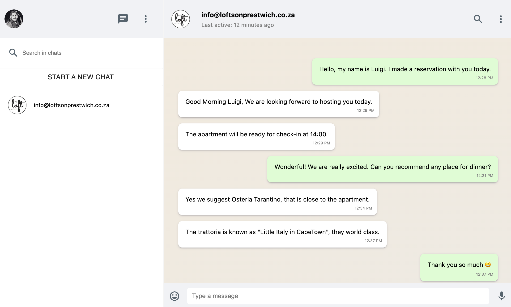
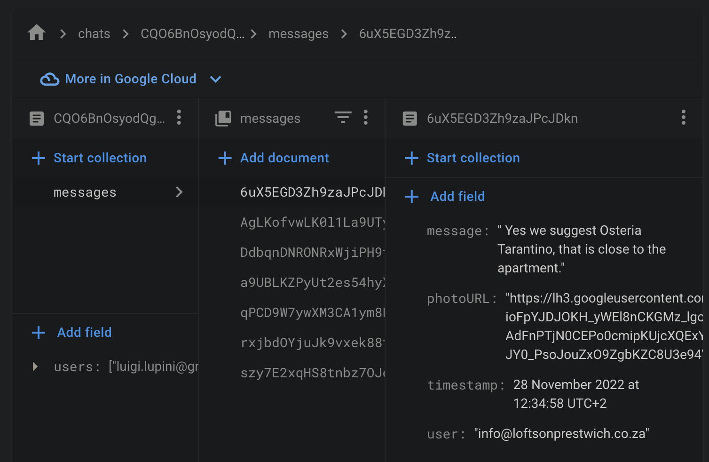

## WhatsApp Clone

> A chat application with Next.js and Firestore.



Featuring:

- A [Next.js](https://nextjs.org/) project bootstrapped with [`create-next-app`](https://nextjs.org/docs/api-reference/create-next-app).
- Using [Material UI](https://mui.com/) library for our React UI components.
- Firebase firebase `auth` and `firestore` along with a Google provider, is being used.
- [Firebase](https://firebase.google.com/docs/web/modular-upgrade) version 9 a more modular Web SDK is being used here.
- [React Firebase Hooks](https://github.com/CSFrequency/react-firebase-hooks) this library explores how React Hooks can make integration with Firebase more straightforward.
- `useAuthState` retrieves and monitors the authentication state from Firebase.
- We use this state from the hook to define a object for our `users` collection.

```js
const usersRef = collection(db, "users");
const userRef = doc(usersRef, user.uid);
let data = {
  userId: user.uid,
  email: user.email,
  lastSeen: serverTimestamp(),
  photoUrl: user.photoURL,
};
await setDoc(userRef, data, { merge: true })
  .then((doc) => console.log("%c setDoc user", "color: green"))
  .catch((error) => console.error(error));
};
// side-effect:
useEffect(() => {
  if (user) addUser(user);
}, [user]);

if (loading) return <Loading />;
if (!user) return <Login />;
```

Once a user is loaded into our application, `<SideBar />` reflects this.

- `useCollection` retrieve and monitor a collection value in Cloud Firestore.
- `<Chat />` makes use of `next/router` to route to dynamic route/page `pages/chat/[id].js`.
- `[id].js` represents individual chat and its inner messages.
- All pre-rendered and fetched from firestore in our Next.js `getServerSideProps`.

```js
export async function getServerSideProps(context) {
  // # [Working with sub-collection to existing doc] (https://stackoverflow.com/questions/70551249/firebase-v9-add-subcollection-to-existing-doc):
  const chatsRef = doc(db, "chats", context.query.id);
  const chatRef = collection(chatsRef, "messages");
  const q = query(chatRef, orderBy("timestamp", "asc"));
  const messageSnap = await getDocs(q);
  const messages = messageSnap.docs
    .map((doc) => {
      return {
        ...doc.data(),
        id: doc.id,
      };
    })
    .map((messages) => ({
      ...messages,
      timestamp: messages.timestamp.toDate().getTime(),
    }));
  console.log("%c getDocs messages collection", "color: green", messages);
  const chatSnap = await getDoc(doc(chatRef));
  const chat = {
    ...chatSnap.data(),
    id: chatSnap.id,
  };
  console.log("%c getDoc chat document", "color: green", chat);
  return {
    props: {
      messages: JSON.stringify(messages),
      chat: chat,
    },
  };
}
```

The document and collection structure for `chats` is the following:



- A nice todo here, move/get our recipient data into server-side returning props for pre-rendering.

Dependencies:

```json
"dependencies": {
  "@emotion/react": "^11.10.5",
  "@emotion/styled": "^11.10.5",
  "@material-ui/core": "^4.12.4",
  "@material-ui/icons": "^4.11.3",
  "@mui/material": "^5.10.15",
  "better-react-spinkit": "^2.0.4",
  "email-validator": "^2.0.4",
  "firebase": "^9.14.0",
  "moment": "^2.29.4",
  "next": "13.0.4",
  "react": "18.2.0",
  "react-dom": "18.2.0",
  "react-firebase-hooks": "^5.1.1",
  "react-hot-toast": "^2.4.0",
  "styled-components": "^5.3.6",
  "timeago-react": "^3.0.5"
},
```

Regards, <br />
Luigi Lupini <br />
<br />
I ❤️ all things (🇮🇹 / 🛵 / ☕️ / 👨‍👩‍👧)<br />

This is a [Next.js](https://nextjs.org/) project bootstrapped with [`create-next-app`](https://github.com/vercel/next.js/tree/canary/packages/create-next-app).

## Getting Started

First, run the development server:

```bash
npm run dev
# or
yarn dev
```

Open [http://localhost:3000](http://localhost:3000) with your browser to see the result.

You can start editing the page by modifying `pages/index.js`. The page auto-updates as you edit the file.

[API routes](https://nextjs.org/docs/api-routes/introduction) can be accessed on [http://localhost:3000/api/hello](http://localhost:3000/api/hello). This endpoint can be edited in `pages/api/hello.js`.

The `pages/api` directory is mapped to `/api/*`. Files in this directory are treated as [API routes](https://nextjs.org/docs/api-routes/introduction) instead of React pages.
